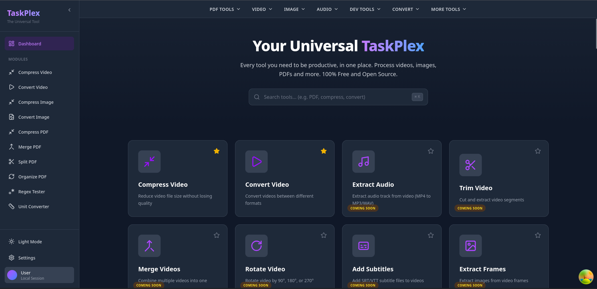

# TaskPlex

A powerful, modern, and open-source utility suite for processing Videos, Images, and PDFs. 
Available as a **Web Application** (Docker) and native **Desktop Applications** (Linux/Windows/macOS) powered by Tauri.



## 🚀 Features

### 🎥 Video Tools
- **Compression**: Reduce file size while maintaining quality with real-time progress tracking (SSE)
- **Conversion**: Convert between MP4, AVI, MKV, MOV, and more
- **Preview**: Built-in video player to preview results
- **Progress Tracking**: Real-time progress updates via Server-Sent Events

### 🖼️ Image Tools
- **Optimization**: Compress JPG, PNG, WEBP images
- **Conversion**: Change image formats instantly
- **Comparison**: Visual Before/After comparison slider

### 📄 PDF Tools
- **Merge**: Combine multiple PDFs into one
- **Split**: Extract pages or split documents
- **Compress**: Optimize PDF file size
- **Organize**: Drag & Drop interface to reorder, rotate, or delete pages
- **Preview**: Built-in PDF viewer with page navigation

### 🛠️ Developer Tools
- **Regex Tester**: Real-time regular expression testing with visual highlighting
- **Unit Converter**: Convert between thousands of units (length, mass, temperature, speed, etc.)

### 🎨 User Experience
- **Smart Search**: Multilingual search across all modules (English, French, Spanish)
- **Dropdown Navigation**: Quick access to all tools via dropdown menus (inspired by iLovePDF)
- **Download Notifications**: Toast notifications with clickable links to open downloaded files
- **Favorites System**: Pin your most-used tools for quick access
- **Dark Mode**: Beautiful dark theme support
- **Responsive Design**: Works seamlessly on desktop and mobile

### 📱 Platforms
- **Desktop**: Linux, Windows, macOS (Tauri)
- **Web**: Docker containerized environment

---

## 🏗️ Architecture

TaskPlex uses a modern hybrid architecture:

- **Frontend**: React 19, Vite, TailwindCSS v3, TypeScript, i18next
- **Backend**: Python 3.12, FastAPI, FFmpeg, Pillow, pypdf
- **Desktop/Mobile**: Tauri v2 (Sidecar pattern: embeds the Python backend as a binary)
- **Web**: Dockerized environment (Nginx + Uvicorn)
- **Real-time**: Server-Sent Events (SSE) for progress tracking

---

## 📦 Installation & Usage

### Option 1: Web Mode (Docker)

Run the full stack in a containerized environment.

```bash
docker-compose up --build
```

### Option 2: Desktop Mode (Tauri)

Download the extension app that you want on the release section of the Github.

## 🧪 Testing

### Frontend Tests

```bash
cd frontend

# Run all tests
npm run test:coverage

```

### Backend Tests

```bash
cd backend

# Run all tests
pytest

```

---

## 📚 Module System

TaskPlex uses a centralized module registry system:

- **100+ modules** planned across multiple categories
- **Implemented modules**: Video (compress, convert), Image (compress, convert), PDF (merge, split, compress, reorganize), Regex Tester, Unit Converter
- **Placeholder modules**: Coming soon features with "Coming Soon" badges
- **Smart categorization**: Media, Documents, Developer, Data, Security, Text, Files, Design

All modules are defined in `frontend/src/config/modules.ts` with translations in `frontend/src/i18n/locales/`.

---

## 🌐 Internationalization

TaskPlex supports multiple languages:
- 🇬🇧 English
- 🇫🇷 Français
- 🇪🇸 Español

The search functionality works across all languages, allowing users to search in their preferred language.

---

## 🤝 Contributing

We welcome contributions! Please see [CONTRIBUTING.md](CONTRIBUTING.md) for guidelines.

### Quick Start for Contributors

1. Fork the repository
2. Create a feature branch: `git checkout -b feature/amazing-feature`
3. Make your changes
4. Run tests: `npm test` (frontend) and `pytest` (backend)
5. Commit your changes: `git commit -m 'Add amazing feature'`
6. Push to the branch: `git push origin feature/amazing-feature`
7. Open a Pull Request

---

## 📄 License

MIT License - Created by Tangjuyo.

---

## 🙏 Acknowledgments

- [Tauri](https://tauri.app/) for the amazing desktop/mobile framework
- [FastAPI](https://fastapi.tiangolo.com/) for the robust API framework
- [React](https://react.dev/) for the UI framework
- All the open-source libraries that make this project possible
